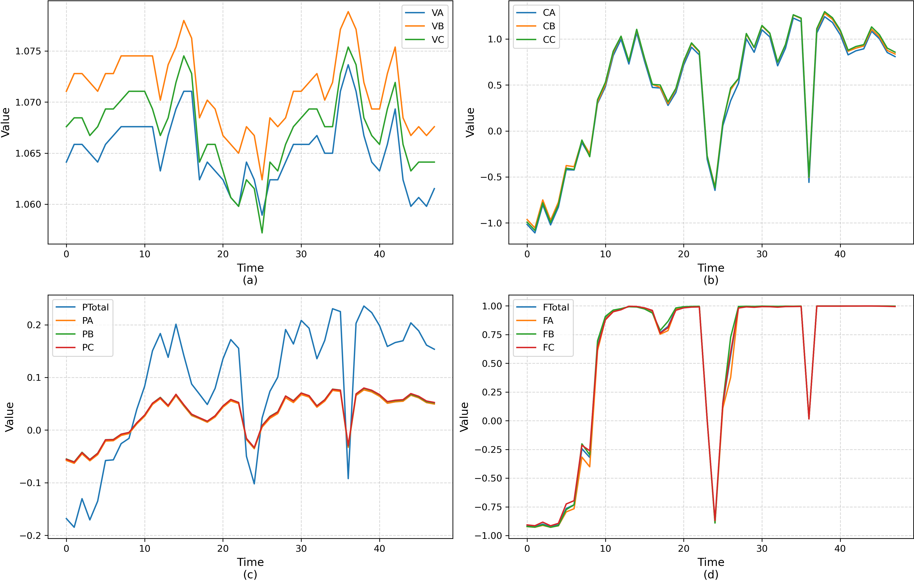
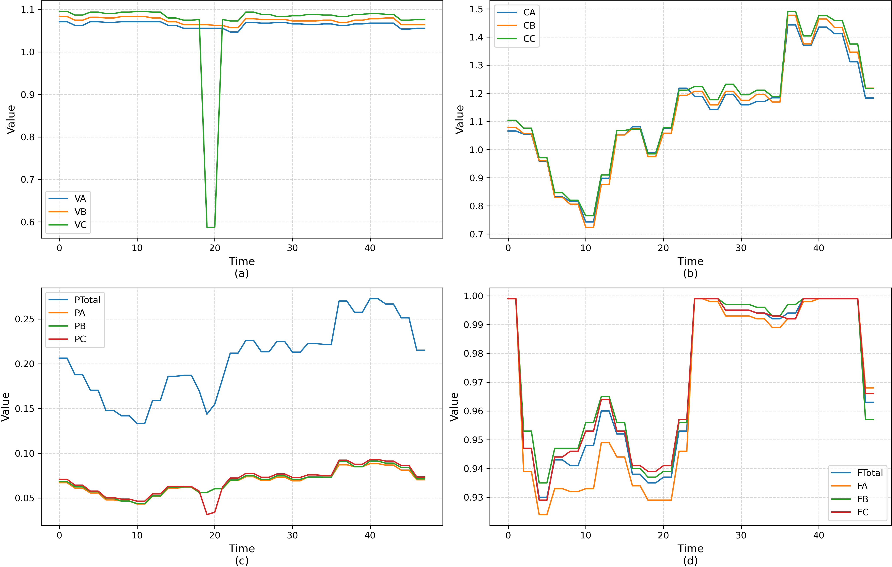
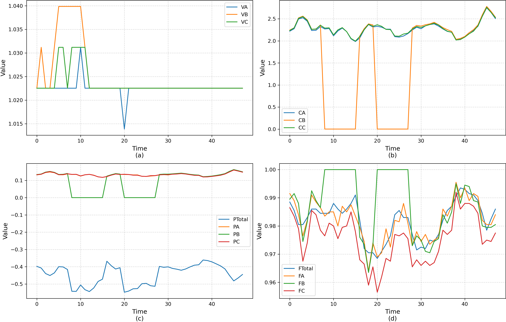
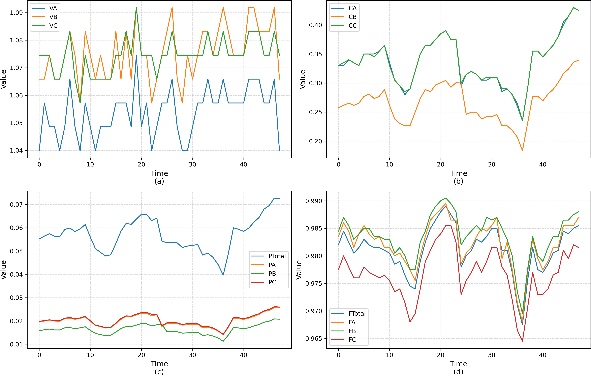
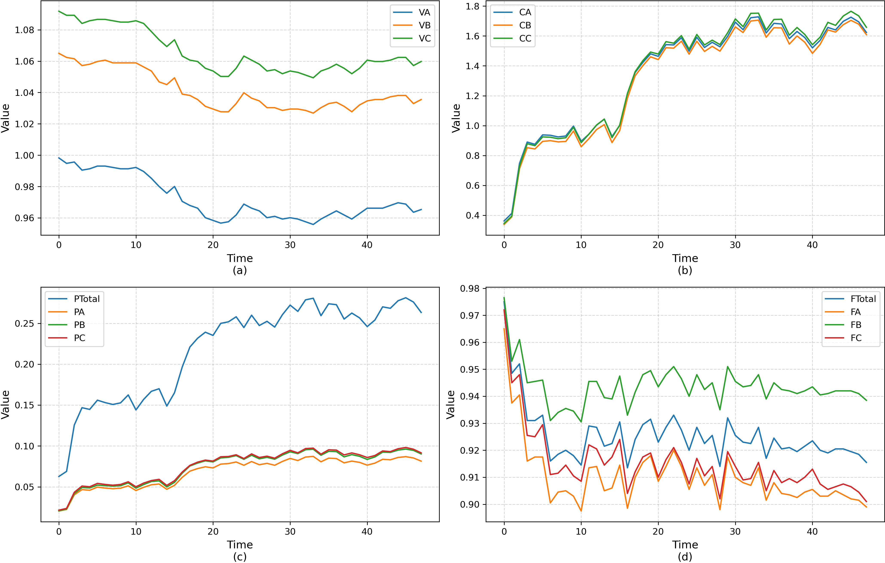
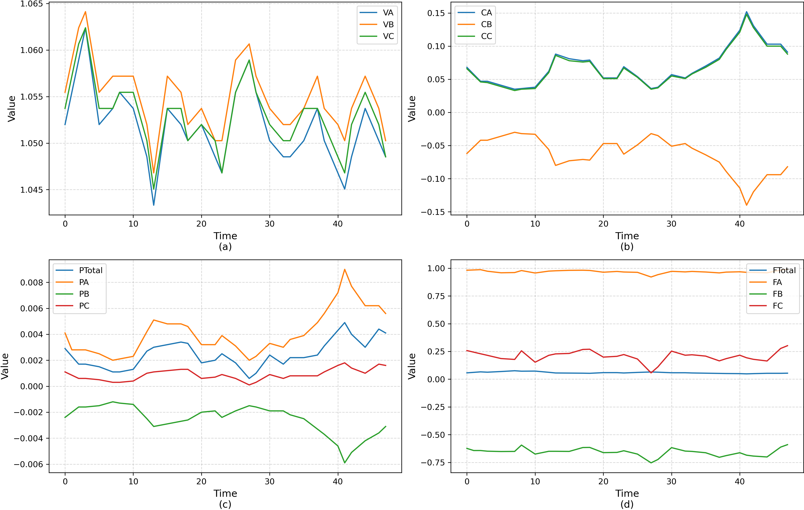
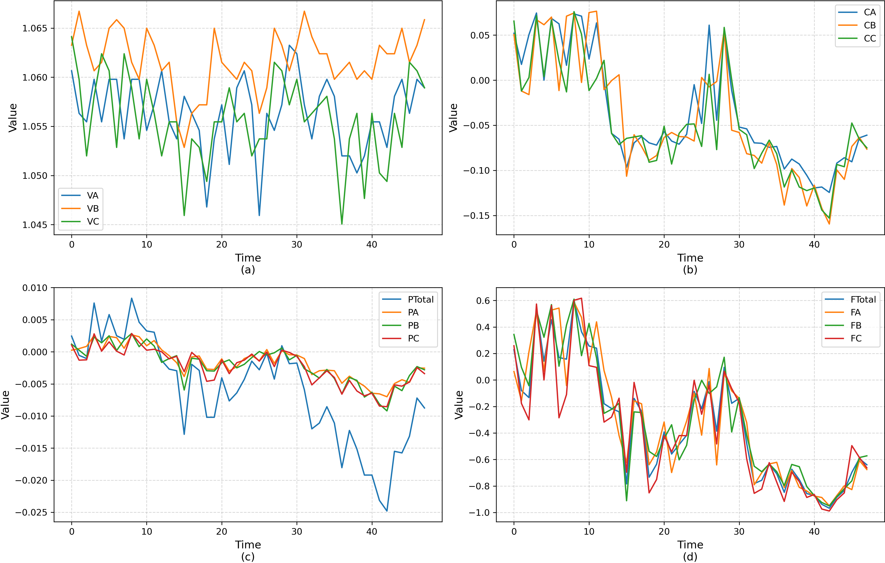

# Metering Anomaly Diagnosis(MAD)
Metering Anomaly Diagnosis (MAD) is a metering anomaly diagnosis dataset for smart meters in smart grid substation, which is used to support multivariate time series classification research.

## Introduction of MAD
The data is entirely sourced from actual deployed Advanced Metering Infrastructure (AMI) systems and holds substantial practical significance for engineering applications. This dataset comprises 504 three-phase four-wire smart meters, among which 382 operate normally while 122 have been manually inspected on-site or professionally labeled as exhibiting various anomalies.

The sampling interval is 30 minutes. As samples are divided by daily cycles, each sample contains 48 data points.

Preprocessing of the dataset has been completed, yielding a total of 7,733 usable samples stored in the MAD.npz file. The training and test sets have already been partitioned, consisting of 2,319 and 5,414 samples respectively, accessible via (x_train, y_train, x_test, y_test) for extraction.

Samples in the dataset fall into 7 categories, where 0 indicates normal operation and categories 1–6 represent six distinct anomaly types. The specific sample distribution is listed in the following table:

| Category ID | Description | number of samples |
| ---- | ---- | ---- |
| 0 | normal | 6021 |
| 1 | Abnormal-1 | 265 |
| 2 | Abnormal-2 | 124 |
| 3 | Abnormal-3 | 128 |
| 4 | Abnormal-4 | 747 |
| 5 | Abnormal-5 | 120 |
| 6 | Abnormal-6 | 328 |

---
## Introduction of sample
All data were collected from three-phase four-wire smart meters, and each sample contained 14 variables, which were 3-phase voltage, 3-phase current, total active power and 3-phase active power, and total power factor and 3-phase power factor. Each variable has been normalized, and the samples of normal and six abnormal cases are as follows:

<p align="center">

<br><br>
<b>Figure 1.</b> Normal Smaple
</p>

<p align="center">

<br><br>
<b>Figure 2.</b>  Abnormal-1
</p>

<p align="center">

<br><br>
<b>Figure 3.</b>  Abnormal-2
</p>

<p align="center">

<br><br>
<b>Figure 4.</b>  Abnormal-3
</p>

<p align="center">

<br><br>
<b>Figure 5.</b>  Abnormal-4
</p>

<p align="center">

<br><br>
<b>Figure 6.</b>  Abnormal-5
</p>

<p align="center">

<br><br>
<b>Figure 7.</b>  Abnormal-6
</p>

---
If you use this dataset please cite the work:

```
@misc{MAD,
  author       = {Wang, F.},
  title        = {{Metering Anomaly Diagnosis}},
  year         = {2025},
  note         = {https://github.com/IISGLab/MeteringAnomalyDiagnosis} 
}
```
