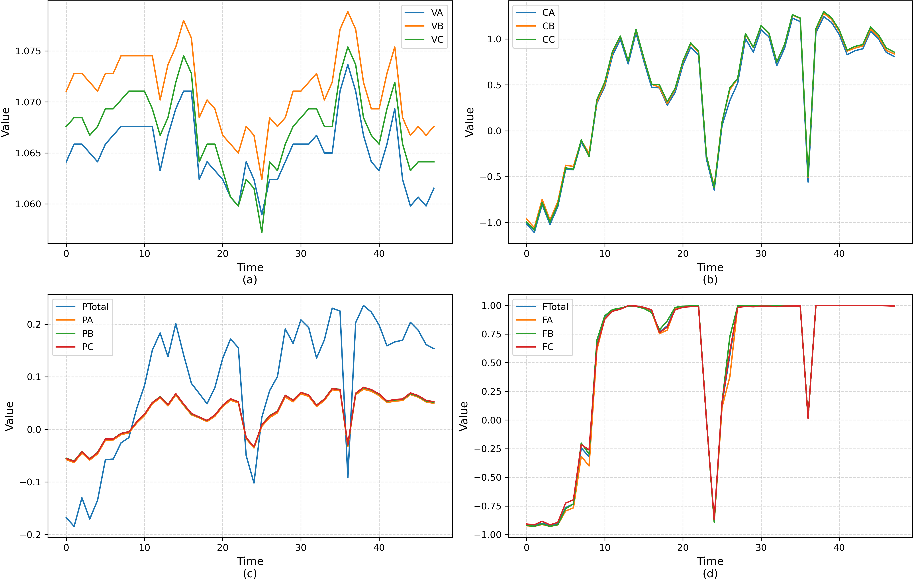
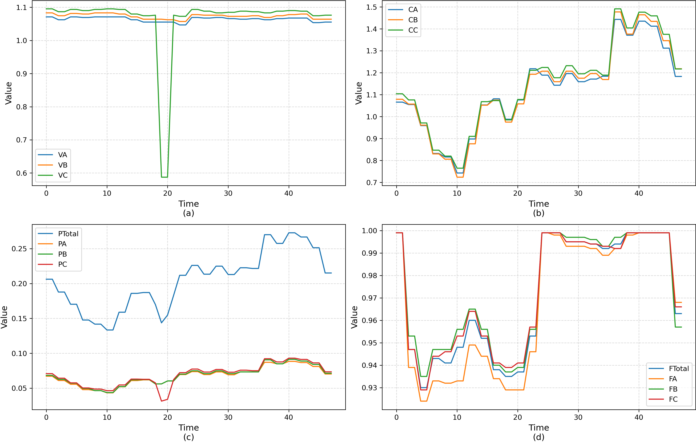
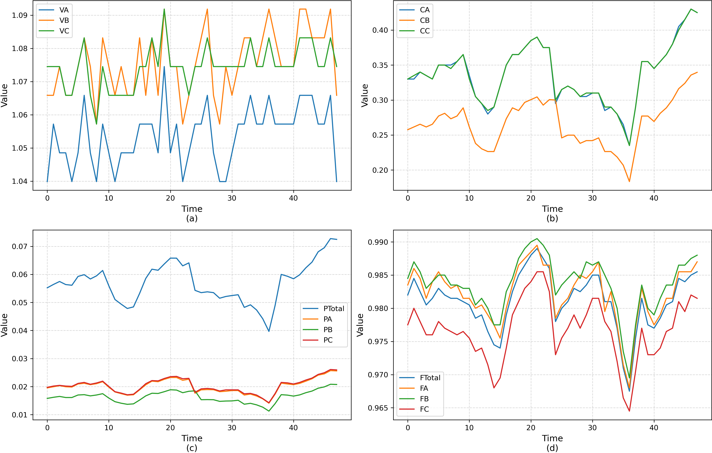
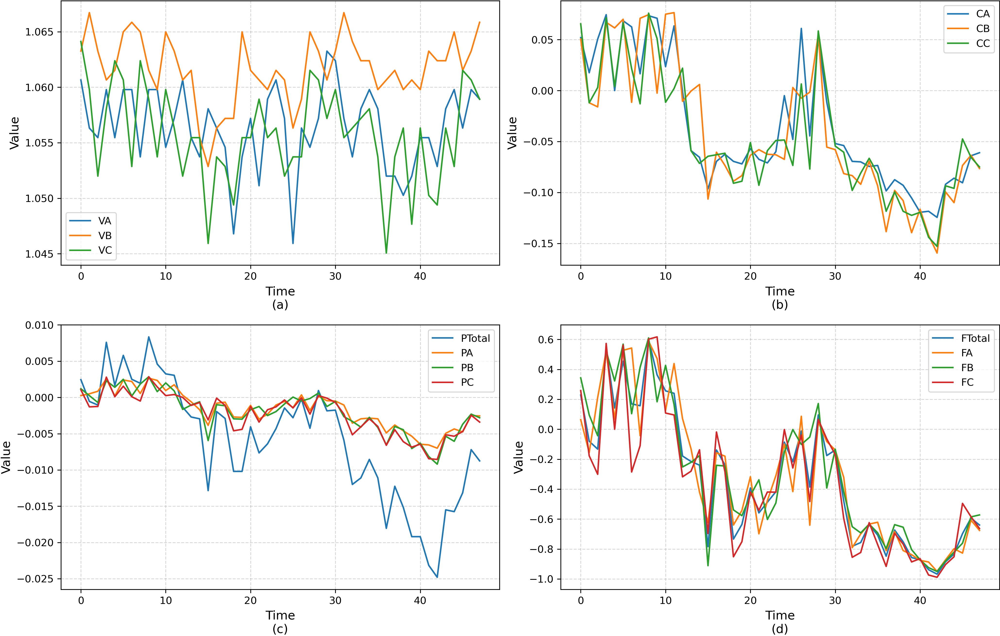

# Metering Anomaly Diagnosis(MAD)
Metering Anomaly Diagnosis (MAD)是一个智能电网变电站智能电表运行状态监测与异常类型识别数据集，用于支撑多变量时间序列分类的研究。

## 数据集简介
这些数据全部来源于实际部署的高级计量基础设施（AMI）系统，具有较高的工程应用代表性。该数据集包含504块三相四线制智能电能表，其中382块为正常电表，122块为在现场人工检修或由专业人员标注存在各类异常的电表。
数据的采样间隔为30分钟。因为我们按照每日划分样本，每个样本包含48个数据点。

数据集中的数据已经完成了预处理，通过整理共得到7421个可用样本，保存于MAD.npz文件。训练集和测试集已完成划分，分别有2319和5414个样本，可用（x_train, y_train, x_test, y_test）进行提取。

数据集的样本包含7个类别，0为正常，1~6为六个异常类型，具体的样本分布如下表所示：

| 类别编号 | 类型描述 | 样本数量 |
| ---- | ---- | ---- |
| 0    | 正常   | 6212 |
| 1    | 异常-1 | 196  |
| 2    | 异常-2 | 85   |
| 3    | 异常-3 | 88   |
| 4    | 异常-4 | 525  |
| 5    | 异常-5 | 81   |
| 6    | 异常-6 | 234  |

---
## 样本介绍
所有数据均采集自三相四线制智能电能表，每个样本均包含14个变量，分别为3相电压、3相电流、总有功功率和3相有功功率，以及总功率因数和3相功率因数。每个变量均已完成归一化处理，正常和6种异常的案例样本如下所示：
<p align="center">

<br><br>
<b>图 1.</b> 正常样本
</p>

<p align="center">

<br><br>
<b>图 2.</b>  异常类型1
</p>

<p align="center">

<br><br>
<b>图 3.</b>  异常类型2
</p>

<p align="center">

<br><br>
<b>图 4.</b>  异常类型3
</p>

<p align="center">

<br><br>
<b>图 5.</b>  异常类型4
</p>

<p align="center">

<br><br>
<b>图 6.</b>  异常类型5
</p>

<p align="center">

<br><br>
<b>图 7.</b>  异常类型6
</p>

---
如果您使用该数据集，请引用该工作：

```
@misc{MAD,
  author       = {Wang, F.},
  title        = {{Metering Anomaly Diagnosis}},
  year         = {2025},
  note         = {https://github.com/IISGLab/MeteringAnomalyDiagnosis} 
}
```
